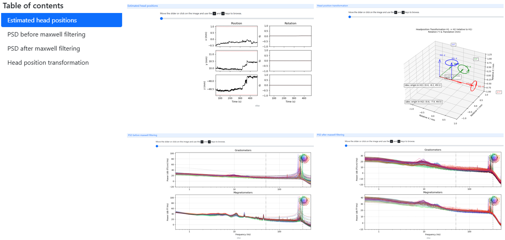
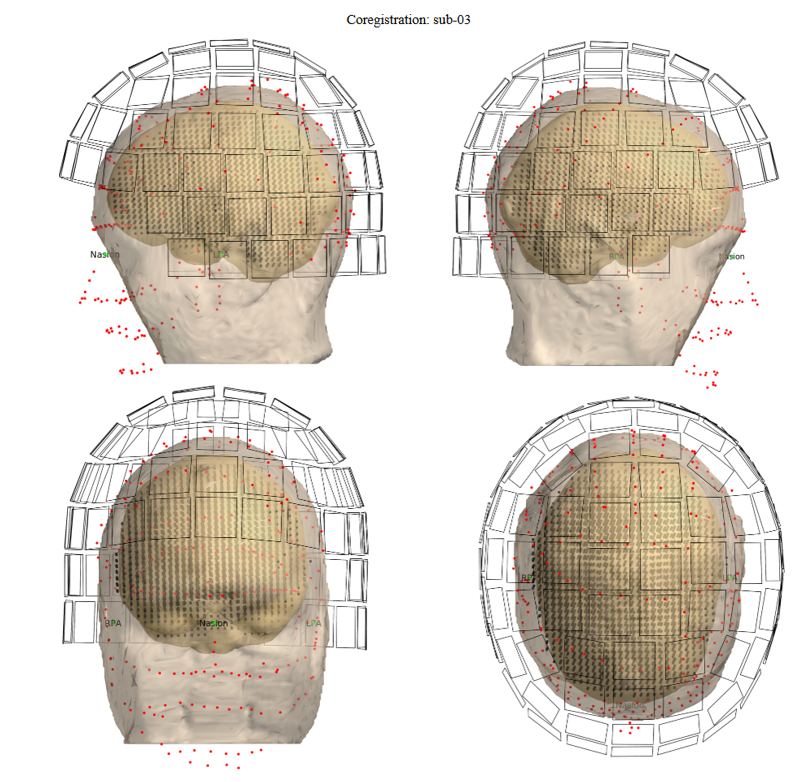

# MEG-SCANS: Code for Technical Validation

This repository contains the code used for the technical validation and generation of plots for the MEG-SCANS (Stories, Chirps, And Noisy Sentences) dataset publication.

## Dataset and Publication

The MEG-SCANS (Stories, Chirps, And Noisy Sentences) dataset provides raw magnetoencephalography (MEG) recordings from 24 German-speaking participants. Each participant listened to approximately one hour of stimuli, including two audiobooks, sentences from the Oldenburger Matrix Sentence Test (OLSA) for Speech Reception Threshold (SRT) assessment, and short up-chirps used to assess MEG signal quality. The dataset comprises MEG data, corresponding audio material (audiobooks, OLSA envelopes, and chirp stimuli), and behavioral audiogram results from hearing screenings. Organized according to the Brain Imaging Data Structure (BIDS), this resource offers a robust benchmark for large-scale encoding/decoding analyses of temporally-resolved brain responses to speech. Comprehensive Matlab and Python code are included to replicate key data validations, ensuring transparency and reproducibility.

* **Dataset:** [DOI to OpenNeuro dataset]
* **Data Descriptor Paper:** [DOI to data descriptor paper]

## Technical Validation Overview

The technical validation covers the following aspects:

* Computation of Auditory Evoked Fields (AEFs) from chirp stimuli and a dipole fit of their N100m component.
* A cross-correlation analysis between audiobook envelopes and MEG data.
* A decoding analysis where models are trained on audiobooks and tested on OLSA sentences.

### Software used during the analysis

**Within the analysis pipelines**
* MATLAB R2023a
* [FieldTrip toolbox](https://www.fieldtriptoolbox.org/) (version: 20250523) 
* [mTRF-Toolbox](https://github.com/mickcrosse/mTRF-Toolbox) (version: 2.7)
* [THE AUDITORY MODELING TOOLBOX](https://amtoolbox.org/) (version: 1.6.0)
  
**For BIDS conversion and Maxwell filtering**
* [MNE-Python](https://mne.tools/stable/index.html) (version: 1.9.0)
* [MNE-BIDS](https://mne.tools/mne-bids/stable/ind) (version: 0.16.0)
  
**Others**
* [Freesurfer](https://surfer.nmr.mgh.harvard.edu/) (version: 7.4.1) (recon-all)

### Running the Pipeline

**Preprocessing**:
The provided MEG data adheres to the Brain Imaging Data Structure (BIDS) standard, which ensures a clear structure and naming scheme.
Additionally, all MEG recordings have undergone an initial preprocessing stage using MaxFilter. This initial step includes spatiotemporal signal space separation (tSSS) for noise reduction and correction for head movements. To facilitate analysis across runs, all of a participant's recordings have also been transformed to a common head position, using their first audiobook run (‘task-audiobook1_run-01‘) as the reference.
Maxfiltered files are shared withtin the `derivatives` folder.

**Getting Started**:
Each analysis pipeline is controlled by a main settings file (e.g., `settings_chirps.m` or `settings_speech.m`). Before running any analysis, you must edit this file to define the paths to the project folder and required toolboxes.
The following key paths need to be set:
* `settings.rootpath`: This is the base path that helps switch between different computer environments (e.g., a local machine vs. a remote server). All other paths are typically constructed relative to this.
  * Example: `settings.rootpath = '/mnt/localSSDPOOL/projects'`
* `settings.path2project`: The full path to this main project folder.
  * Example: `settings.path2project = fullfile(settings.rootpath, 'meg_scans')`
* `settings.path2toolboxes`: The full path to the directory where all required toolboxes (like FieldTrip, mTRF-Toolbox, etc.) are stored.
  * Example: `settings.path2toolboxes = fullfile(settings.rootpath, 'toolboxes')`

## Auditory Evoked Fields (AEFs)

The AEF analysis is divided into sensor-level and source-level analyses, with settings configured in `settings_chirps.m`. More detailed descriptions of each script's functionality can be found within the scripts themselves. This pipeline does not include a master script. The following scripts must be run manually in the order they are presented below.

### Sensor Level Analysis 

| Script Name | Description |                                                                                                                                                                                             
| :--- | :--- |
| `compute_aefs.m` | Processes chirp stimuli to compute subject-level AEFs. It then calculates and saves the grand average across all subjects. |
| `plot_aefs_subjectlevel.m` | Generates a comprehensive set of visualizations for a single subject's AEF data, including sensor layouts, single-channel visualizations, and topographies. |
| `plot_aefs_grouplevel.m` | Creates summary figures for the group-level AEF analysis. It plots the grand-average and overlays individual subject data for comparison. It generates Figure XX in the publication ([DOI to data descriptor paper]). |

### Source Level Analysis

| Script Name | Description |                                                                                                                                                                                               
| :--- | :--- |
| `compute_headmodel_sourcemodel.m` | Creates subject-specific head and source models from anatomical MRIs. It also generates an HTML report for quality control. An excerpt from this report is shown below. The co-registration information is already provided by the BIDS dataset. |
| `check_coregistration.m` | Loads pre-computed model files to generate plots that verify the coregistration alignment between sensors, head model, source model and mri. |
| `compute_dipolefit.m` | Performs dipole model fitting using a two dipole model on a subject's AEF data (N100m peak) to estimate the location of the underlying neural sources. |                                             | `plot_dipolefit_subjectlevel.m` | Visualizes a single subject's dipole fit results, including dipole locations on the MRI and the reconstructed source time courses. |                                                       | `plot_dipolefit_grouplevel.m` | Analyzes group dipole data by excluding poor fits and computing the group-average location and source time course. It then visualizes these group-level results. It generates Figure XX in the publication ([DOI to data descriptor paper]). |

## Cross-correlation analysis
This section describes the cross-correlation analysis performed for the technical validation of the speech material. This analysis examines the relationship between audiobook onset envelopes and magnetoencephalography (MEG) recordings, drawing inspiration from Petersen et al. (2016) [[doi:10.1152/jn.00527.2016]](https://doi.org/10.1152/jn.00527.2016). The specific settings for this cross-correlation analysis are configured in `settings_speech.m`. The analysis workflow is divided into the following scripts:

| Script Name | Description |                                                                                                                                                                                               
| :--- | :--- | 
| `analysis_pipeline_crosscorr.m` | Master script that orchestrates the entire cross-correlation pipeline. It calls preprocessing and computation functions for each subject in parallel, then computes the grand average. |
| `preprocessing_audio.m` | Prepares audiobook stimuli by computing the onset envelope and segmenting it into epoched and downsampled trials. |
| `preprocessing_crosscorr.m` | Processes a single subject's continuous MEG data and synchronizes it with pre-processed audio epochs. This includes rejecting invalid trials and truncating all pairs to a uniform length. |
| `computation_crosscorr.m` | Computes the subject-level cross-correlation between MEG and audio. It also creates a null distribution using shuffled trial pairings for statistical comparison. |
| `computation_gavg_crosscorr.m` | Computes the group-level grand average by loading and averaging all individual subject cross-correlation results. |
| `plot_crosscorr.m` | Visualizes the grand-average cross-correlation results and performs a cluster-based permutation test to find significant effects. This script generates the main cross-correlation figures. It is responsible for creating Figure XX in the publication ([DOI to data descriptor paper]). |

## Decoding analysis
This section describes the decoding-based analysis used for the technical validation of the speech material, for both audiobook and olsa recording. The analysis aimed to reproduce the results of Vanthornhout et al. (2018) [[doi:10.1007/s10162-018-0654-z]](https://doi.org/10.1007/s10162-018-0654-z) by training a backward model (decoder) on continuous audiobook data and testing its ability to reconstruct the speech envelopes of unseen OLSA sentences. The temporal response function (TRF) framework used for training and evaluating the decoder is described in detail e.g. by Crosse et al. (2021) [[doi:10.3389/fnins.2021.705621]](https://doi.org/10.3389/fnins.2021.705621) and O'Sullivan et al. (2014) [[doi:10.1093/cercor/bht355]](https://doi.org/10.1093/cercor/bht355).
The decoding analysis pipeline closely follows the structure of the cross-correlation pipeline. The analysis workflow is divided into the following scripts:

| Script Name | Description |                                                                                                                                                                                               
| :--- | :--- | 
| `analysis_pipeline_decoding.m` | Master script that orchestrates the entire decoding analysis pipeline. It calls preprocessing and training functions for each subject in parallel. |
| `preprocessing_olsa.m` | Prepares OLSA sentence stimuli by individually processing each .wav file into a filtered and resampled auditory envelope. Due to sharing restrictions, the raw .wav files are not provided in this repository, only the final processed envelopes. Therefore, this script is included for transparency but cannot be run directly. |
| `preprocessing_audiobooks.m` | Prepares audiobook stimuli by computing the auditory envelope and segmenting it into fixed-length epochs. |
| `preprocessing_audiobooks_decoding.m` | Prepares a subject's audiobook MEG data and synchronizes it with pre-processed audio envelopes. It rejects invalid trials and truncates all pairs to a uniform length. |
| `preprocessing_olsa_decoding.m` | Prepares a subject's OLSA MEG data and synchronizes it with the corresponding sentence envelopes. It creates detailed trial information by loading metadata from the events.tsv file. |
| `training_decoding.m` | Trains a neural decoding model on audiobook data. It then evaluates the model's performance and its ability to generalize to the separate OLSA sentence task. |
| `plot_decoding.m` | Analyzes and visualizes the results of the decoding pipeline. It plots model training performance and the generalization results on the OLSA task. This script is responsible for creating Figure XX in the publication ([DOI to data descriptor paper]). |

## Additional functions
The `audio_envelopes.m` script in the `speech` directory provides a tool for detailed visualization of the envelopes used in both the cross-correlation and decoding analyses.
| Script Name | Description |                                                                                                                                                                                               
| :--- | :--- | 
| `audio_envelopes.m` | This script contained in the `speech` directory is an interactive tool for visualizing the speech envelopes used in the cross-correlation and decoding analyses. It processes a selected audiobook file, computes the desired envelope type (e.g., auditory, onset), and generates a multi-panel plot with a slider to easily compare the raw audio waveform against its derived envelope. |

### Helper function for Plotting, Source Analysis, Envelope Calculation and FieldTrip Trial Functions
The `helper_functions` directory contains custom functions used across various analysis pipelines.

| Script Name | Description |                                                                                                                                                                                               
| :--- | :--- | 
| `bluewhitered.m` | Generates a divergent blue-white-red colormap, ideal for topographical plots. |
| `distinguishable_colors.m` | Creates a set of maximally distinct colors, used for plotting data from different subjects. |
| `check_diploc.m` | Determines the hemisphere location of a fitted dipole. |
| `constrained_dipolfitting.m` | Calculates the scalar dipole moment for a fixed-orientation two-dipole model. |
| `cal_envelope.m` | Computes various types of speech envelopes (e.g., onset, auditory) from raw audio. |
| `my_trialfun_audiobook.m` | A custom `trialfun` that defines epochs from the audiobook recordings based on triggers. |
| `my_trialfun_olsa.m` | A custom `trialfun` that defines epochs from the OLSA recordings. |
| `read_event_modified.m` | A custom function to read events from Neuromag .fif files, that can be used in `my_trialfun_audiobook.m` as an option.  |

### Maxfilter 
The following Python scripts are provided to apply Maxwell filtering to the raw BIDS data and visualize the results.

| Script Name | Description |                                                                                                                                                                                               
| :--- | :--- | 
| `apply_maxfilter_parallel.py` | Applies a Maxwell filtering pipeline (tSSS, movement correction, and head position alignment) to raw MEG data. It processes subjects in parallel and generates a comprehensive HTML quality control report for each one. |
| `plot_trafo.py` | Creates a detailed 3D visualization of a 4x4 head position transformation matrix. It plots the initial and transformed coordinate systems, the translation vector, and the rotation angles. This figure is included in the reports. | 
| `check_maxfilter_stats.py` | Loads a CSV file of head transformation data and generates two summary figures: one showing histograms of the overall movement distributions, and another displaying scatter plots that compare the amount of movement for each subject. | 

An example from the Maxwell filtering report is shown below. This report is generated for each subject for visual quality control and includes a visualization of the estimated head positions, the Power Spectral Densities (PSDs) before and after filtering, and the 3D head position transformation applied to align each run.

An example of the coregistration report is shown below. This report is created for each subject to allow for visual inspection of the alignment between the sensor and anatomical data.

**Available Upon Request**

The following scripts were used to generate or present the data but are not included in this repository. They are available upon request.
* BIDS conversion pipeline
* Experiment presentation scripts (for chirp, audiobook, and OLSA tasks)
* FreeSurfer `recon-all` batch script
